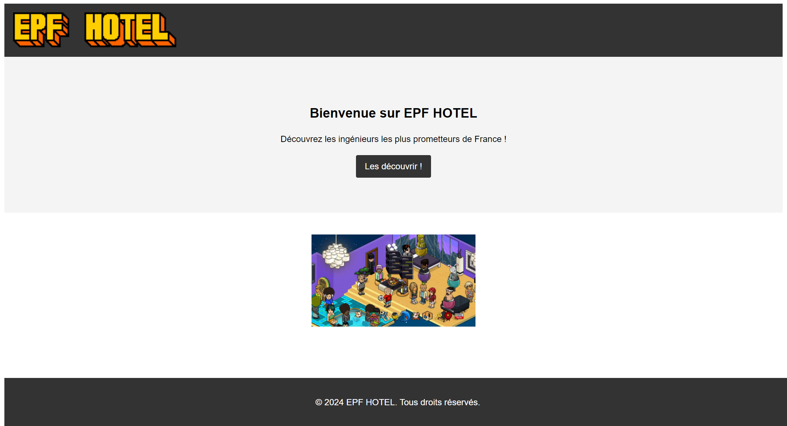
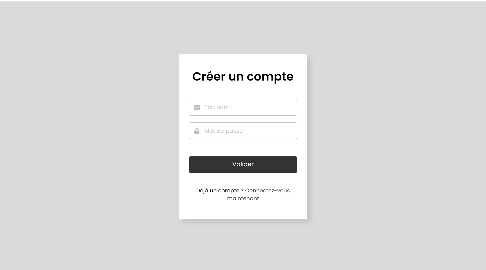
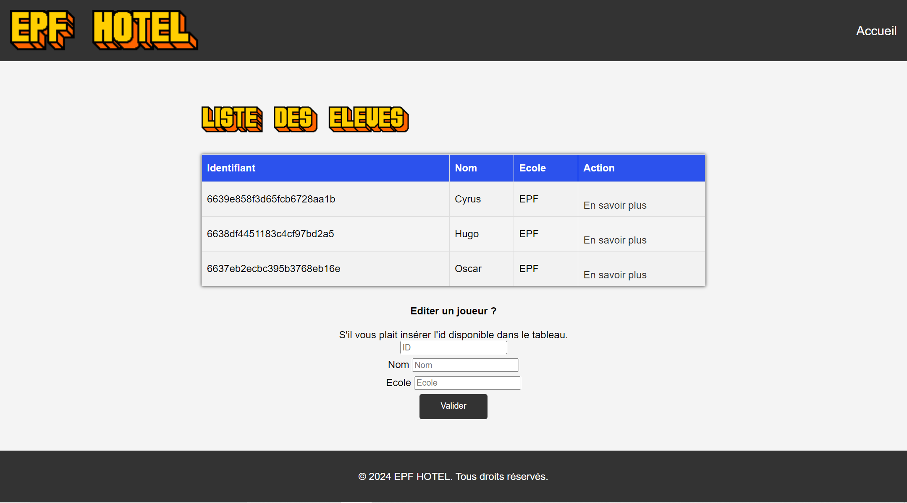
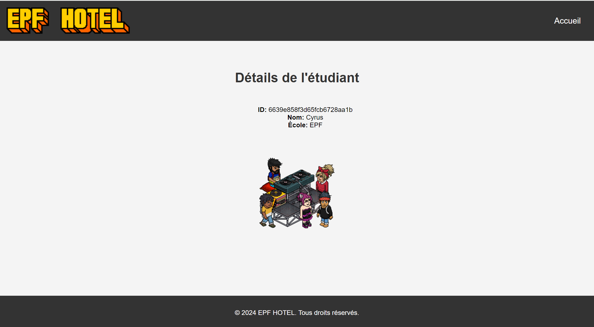

# Projet EPF Hotel

## Brève description

Ce projet est une application web simple qui permet de découvrir des étudiants de n'importe quelles écoles. L'utilisateur pourra également les gérer.

## Installation et exécution
### Installation sans Docker

Pour installer et exécuter cette application, veuillez suivre les étapes suivantes :

1. **Installation de Node.js** : Node.js doit être installé sur votre machine. 

   Pour les instructions d'installation de NodeJS, visitez le site internet de nodeJS : https://nodejs.org/en/download/current.

2. **Navigation vers le répertoire du projet** : Accédez au répertoire du projet : `cd <répertoire-du-projet>`
3. **Installation des dépendances** : Installez les dépendances du projet via NPM : `npm install`
4. **Démarrage du serveur** : Démarrez le serveur : `npm run dev`
5. **Accès à l'application** : Ouvrez votre navigateur et accédez au site à l'adresse <http://localhost:3000>. L'application a besoin d'avoir accès à une connexion internet afin d'accéder à la base de données MongoDB.

6. **Arrêt du serveur** : Vous pouvez stopper le serveur avec la combinaisons des touches controle et C dans le terminal de commande.

### Installation avec Docker

1. **Installation de Docker** : Pour installer Docker, si ce n'est pas déjà fait, vous pouvez le télécharger à partir de ce lien : [Télécharger Docker](https://www.docker.com/products/docker-desktop/)

2. **Navigation vers le répertoire du projet** : Accédez au répertoire du projet : `cd <répertoire-du-projet>`

3. **Création d'une image docker**  : Exécutez la commande suivante pour créer l'image Docker.
`docker build . -t docker-nodejs`

4. **Démarrage du serveur** : Exécutez l'image que vous avez précédemment créée :

`docker run -p 49160:3000 -d docker-nodejs`

5. **Accès à l'application** : Ouvrez votre navigateur et accédez au site à l'adresse <http://localhost:49160>.

6. **Arrêt du serveur** : Pour arrêter le conteneur, allez dans Docker Desktop et mettez en pause le containeur ayant comme image docker-nodejs.

## Exercice 0 : Découverte du personnage dans l'API Rick et Morty

Le personnage portant le numéro d'identifiant 5 dans l'API Rick et Morty est Jerry Smith.
Afin d'avoir ce résultat, nous avons effectuer cette requête sur Postman : https://rickandmortyapi.com/api/character/5.

## Fonctionnalités
1. **Authentification**
L'application utilise l'authentification pour restreindre l'accès à certaines fonctionnalités aux utilisateurs autorisés. Les utilisateurs sont stockés dans la base de données MongoDB. L'utilisateur aura la possibilité de se créer un compte ou de s'identifier.

2. **Liste des élèves**
Une fois authentifié, l'utilisateur peut accéder à la liste des étudiants enregistrés dans la base de données. Chaque étudiant est affiché avec son ID, son nom et son école. L'utilisateur peut également cliquer sur un étudiant pour obtenir plus de détails. Chaque image d'illustration d'un étudiant est choisi aléatoirement.

3. **Modification des étudiants**
L'utilisateur peut éditer les détails d'un étudiant en fournissant l'ID de l'étudiant, son nouveau nom et sa nouvelle école. 

## Contributeur
Ce projet a été réalisé par Cyrus LARGER dans le cadre d'un projet universitaire.

## Captures d'écran de l'applications

